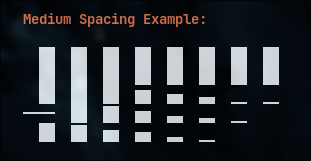

# CyberSpec

A cyberpunk-themed CLI spectrum analyzer for Linux with an auto-sized band count, multiple bar styles, and peak-hold markers that fade out.



## Features

- **Real-time audio visualization** - Captures and visualizes system audio via PipeWire/PulseAudio
- **16-band spectrum** - Logarithmic frequency distribution for musical accuracy
- **Bar styles** - `solid`, `led`, `braille`, `gradient`
- **Layouts** - `vertical` (classic) and `butterfly` (horizontal, stereo split: left channel grows left, right grows right)
- **Fading peaks** - Peak-hold markers that fade to black on quiet bands (perceptually-even gamma fade)
- **Dual color schemes** - Classic (Green→Yellow→Red) and Synthwave (Cyan→Magenta)
- **A-weighting curve** - Balanced frequency response for visually appealing output
- **Smooth motion** - Exponential moving average smoothing reduces jitter
- **Highly configurable** - Extensive documentation for customization

## Requirements

- **Linux** (EndeavourOS, Arch, or any distro with PipeWire/PulseAudio)
- **Go 1.21+**
- **PipeWire** or **PulseAudio** (for audio capture)
- **Terminal** with Unicode support (Kitty, Alacritty, Ghostty, etc.)

## Installation

### Build from Source

```bash
# Clone or navigate to the project
cd ~/code/cyberspec

# Download dependencies
go mod tidy

# Build
go build -o cyberspec

# Optional: Install to PATH
sudo cp cyberspec /usr/local/bin/
```

## Usage

### Basic Usage

```bash
# Run the spectrum analyzer
./cyberspec
```

The analyzer will automatically:
1. Connect to PipeWire/PulseAudio
2. Capture system audio output (monitor source)
3. Display real-time spectrum visualization

### Keyboard Controls

| Key | Action |
|-----|--------|
| `c` | Cycle color schemes |
| `1` | Switch to Classic scheme (Green→Yellow→Red) |
| `2` | Switch to Synthwave scheme (Cyan→Magenta) |
| `+` / `=` | Increase gain (+0.1x) |
| `-` / `_` | Decrease gain (-0.1x) |
| `0` | Reset gain to 1.0x |
| `q` / `ESC` | Quit |
| `Ctrl+C` | Force quit |

### Tips

- **Low visualization?** Increase gain with `+` key
- **Too sensitive?** Decrease gain with `-` key  
- **Bars too jumpy?** Adjust smoothing in `viz/config.go`
- **Want more detail?** Increase `NUM_BANDS` in config

## Configuration

All behavior is configurable via `viz/config.go`. See comprehensive docs:

- **[Configuration Guide](docs/CONFIGURATION.md)** - All configurable constants
- **[Algorithm Documentation](docs/ALGORITHMS.md)** - How algorithms work
- **[Implementation Plan](docs/IMPLEMENTATION_PLAN.md)** - Complete technical details

### Quick Configuration Examples

**High Performance (Low CPU):**
```go
// viz/config.go
const TARGET_FPS = 20
const FFT_SIZE = 1024
const SMOOTHING_ALPHA = 0.3
```

**Maximum Quality:**
```go
// viz/config.go
const TARGET_FPS = 60
const FFT_SIZE = 4096
const SMOOTHING_ALPHA = 0.5
```

**Faster peak fade:**
```go
// viz/config.go
const PEAK_FADE_MS = 700
```

## Architecture

### Processing Pipeline

```
Audio Output → PipeWire → Monitor Source
                            ↓
                    Audio Capture (48kHz stereo)
                            ↓
                    Mix to Mono + FFT (2048)
                            ↓
                    A-Weighting Curve
                            ↓
                    16 Logarithmic Bands
                            ↓
                    EMA Smoothing (α=0.4)
                            ↓
                    Peak Detection & Fade
                            ↓
                    Bar Rendering (solid / led / braille)
                            ↓
                    Terminal Output (30 FPS)
```

### Key Algorithms

1. **Spectral tilt** - Gentle high-frequency lift for a balanced picture
2. **Auto gain** - cava-style sensitivity tracking so the display breathes with the music
3. **Peak Fade** - Peak-hold marker fades to black over PEAK_FADE_MS on quiet bands, gamma-bent so the fade looks even
4. **Attack/release smoothing** - Fast rise, slow fall, like a VU meter

See [docs/ALGORITHMS.md](docs/ALGORITHMS.md) for detailed explanations.

## Project Structure

```
cyberspec/
├── main.go              # Bubbletea TUI and main loop
├── audio/
│   └── capture.go       # PipeWire/PulseAudio audio capture
├── dsp/
│   ├── fft.go          # FFT processing with Hann window
│   ├── bands.go        # Logarithmic frequency band mapping
│   └── weighting.go    # A-weighting curve calculation
├── viz/
│   ├── config.go       # All configurable constants
│   ├── renderer.go     # Bar rendering (solid / led / braille)
│   ├── peaks.go        # Peak-hold tracking + fade timer
│   ├── colors.go       # Color schemes and interpolation
│   └── smooth.go       # Temporal smoothing (EMA)
└── docs/
    ├── IMPLEMENTATION_PLAN.md
    ├── ALGORITHMS.md
    ├── CONFIGURATION.md
    └── decay-inspiration.png
```

## Troubleshooting

### No Visualization / Bars Not Moving

1. **Check audio is playing:**
   ```bash
   paplay /usr/share/sounds/alsa/Front_Center.wav
   ```

2. **Verify PipeWire is running:**
   ```bash
   ps aux | grep pipewire
   ```

3. **Check monitor source exists:**
   ```bash
   pactl list sources | grep monitor
   ```

4. **Increase gain:** Press `+` multiple times

### Low FPS / Choppy Performance

1. **Reduce FFT size** in `viz/config.go`: `FFT_SIZE = 1024`
2. **Reduce target FPS**: `TARGET_FPS = 20`
3. **Reduce bands**: `NUM_BANDS = 8`
4. **Check CPU usage** (should be <5%): `htop`

### Bars Too Jumpy / Jittery

1. **Increase smoothing:** `SMOOTHING_ALPHA = 0.2` (more smooth)
2. **Reduce gain** with `-` key

### Compilation Errors

1. **Missing pulse-simple:**
   ```bash
   # Arch/EndeavourOS
   sudo pacman -S libpulse

   # Ubuntu/Debian
   sudo apt install libpulse-dev
   ```

2. **Go version too old:**
   ```bash
   go version  # Should be 1.21+
   ```

## Technical Details

### Performance Targets

- **Target FPS:** 30 frames per second
- **CPU Usage:** <5% on modern CPU
- **Latency:** ~33ms (one frame at 30 FPS)
- **Memory:** <50 MB

### Audio Specifications

- **Sample Rate:** 48000 Hz
- **Format:** Float32LE stereo → mixed to mono
- **Buffer Size:** 1600 samples (~33ms)
- **FFT Size:** 2048 samples
- **Window:** Hann window
- **Frequency Range:** 20 Hz - 20 kHz

### Dependencies

- `github.com/charmbracelet/bubbletea` - TUI framework
- `github.com/charmbracelet/lipgloss` - Terminal styling
- `github.com/mesilliac/pulse-simple` - PulseAudio capture
- `github.com/mjibson/go-dsp` - FFT implementation

## Future Enhancements

See [docs/IMPLEMENTATION_PLAN.md](docs/IMPLEMENTATION_PLAN.md) for complete list:

- Stereo visualization (left/right channels)
- Per-band gain adjustment
- Config file support (TOML/YAML)
- Additional color schemes
- Beat detection with pulse effects
- Recording mode (save to video)
- MIDI controller support

## Documentation

- **[Configuration Guide](docs/CONFIGURATION.md)** - Complete reference for all configurable constants
- **[Algorithm Documentation](docs/ALGORITHMS.md)** - Detailed algorithm explanations and alternatives
- **[Implementation Plan](docs/IMPLEMENTATION_PLAN.md)** - Complete technical architecture

## License

*To be determined by project owner*

## Credits

**Concept & Design:** User specifications  
**Decay Pattern Inspiration:** User-provided screenshot  
**Implementation:** OpenCode  
**Audio System:** PipeWire/PulseAudio  
**TUI Framework:** Charm Bracelet (Bubbletea, Lipgloss)  
**DSP Library:** go-dsp (mjibson)

---

**Built for:** EndeavourOS + Hyprland  
**Terminals:** Kitty, Alacritty, Ghostty  
**Made with:** ❤️ and FFTs
