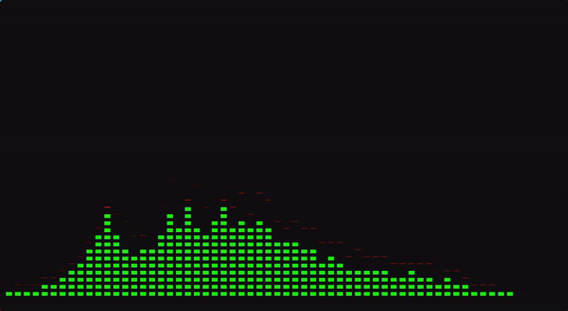

# CyberSpice

A cyberpunk-flavoured CLI spectrum analyser for Linux. It captures whatever
your speakers are playing and draws it as a log-spaced frequency
visualisation — auto-sized to the terminal, with peak-hold markers that fall
and then fade out, two colour schemes, four bar styles, a horizontal
"butterfly" stereo layout, and a braille-halftone intro splash.



## Unapologetically vibe-coded

This was built conversationally with an AI coding agent and tuned by
screenshot and feel rather than by spec. It runs well on the author's setup
(EndeavourOS + Hyprland, Kitty/Ghostty). Treat it as a fun artifact, not a
reference implementation — the DSP is "close enough to look good", not
"correct".

The motion — attack/release pacing, and peak markers that fall about half as
fast as the bars before fading — is modelled on
[**vis-cli-visualizer**](https://github.com/dtoraelek/vis-cli-visualizer).
The auto-gain is [**cava**](https://github.com/karlstav/cava)-style; the
"monstercat" spatial smoothing comes from
[**dpayne/cli-visualizer**](https://github.com/dpayne/cli-visualizer). The
`constellation` bar style is ported from the effect of the same name in
[**oiwn/tarts**](https://github.com/oiwn/tarts) (MIT).

## Features

- **Live capture** of the default sink's monitor source (PipeWire /
  PulseAudio), low-latency — capture runs on its own goroutine with an
  explicit buffer size so a slow frame can't make audio lag.
- **Auto-sized** band count — fills the terminal, re-flows on resize.
- **Bar styles:** `solid`, `led` (segmented), `braille` (4× sub-row), `gradient`,
  `constellation` (drifting, twinkling points connected by faint lines —
  ported from [**oiwn/tarts**](https://github.com/oiwn/tarts) and made
  audio-reactive: loudness drives drift speed, bass widens the connection
  web, treble speeds the twinkle, and a transient fires a brightness flash.
  Colour isn't one flat field-wide hue — every time a frequency band peaks,
  a colour ring spawns *at that band's own position* and expands outward
  from there, fading as it travels: a full 360° in `vertical`, a ~180° fan
  per side in `butterfly` (each channel lighting up its own half
  independently, mirrored left/right).
- **Layouts:** `vertical` (classic) and `butterfly` (horizontal, stereo — low
  freq at the bottom, left channel grows left, right grows right).
- **Peak markers** that hold, fall, then fade to black with a gamma-corrected
  ramp so the fade looks even. Falling is toggleable; markers can't catch a
  falling bar.
- **cava-style auto-gain** — the display *breathes* with the music instead of
  being renormalised to full scale every frame. Manual trim on top.
- **Spectral tilt** — a boost-only high shelf, the middle ground between raw
  FFT (bass-heavy) and A-weighting (bass gone). Live-adjustable.
- **Loudness curve** — `linear`, `stevens` (perceptual power law), or a fixed
  `db` window.
- **Two colour schemes** — Classic (green→yellow→red) and Synthwave
  (cyan→magenta), driven like an RGB LED.
- **HACKERBOT intro splash** — a braille halftone of a 1950s-tin-robot still
  that dissolves into a pool of dots and fades before the visualiser starts.
- **TOML config** at `~/.config/cyberspice/config.toml`, written in-app with `w`.

Full detail and the maths: **[docs/how-it-works.md](docs/how-it-works.md)**.

## Requirements

- **Linux** with **PipeWire** or **PulseAudio** running (it records the
  default output's `.monitor` source).
- **Go 1.25+** (see `go.mod` — the `go-dsp` FFT dependency sets the floor;
  older Go auto-fetches a newer toolchain).
- **A C toolchain + libpulse headers** — the audio binding is cgo:
  - Arch / EndeavourOS: `sudo pacman -S libpulse base-devel`
  - Debian / Ubuntu: `sudo apt install libpulse-dev build-essential`
- A **truecolor (24-bit) terminal** — Kitty, Alacritty, Ghostty, WezTerm,
  foot, modern xterm. For the `braille` style and the intro splash you also
  want a font with **braille (U+2800–28FF)** coverage — any Nerd Font,
  JetBrains Mono, Cascadia Code, Fira Code, etc.

## Build

```bash
git clone https://github.com/revdandom/cyberspice && cd cyberspice
go build -o cyberspice .
./cyberspice

# optional
sudo install -m755 cyberspice /usr/local/bin/
```

The splash still is embedded in the binary (`viz/hackerbot.jpg`,
~340 KB), so there are no runtime assets.

## Usage

```
./cyberspice [flags]
```

### Flags

| Flag | Values | Default | Notes |
|------|--------|---------|-------|
| `-style` | `led` `solid` `braille` `gradient` `constellation` | `solid` | bar rendering style |
| `-color` | `classic` `synthwave` | `synthwave` | colour scheme |
| `-layout` | `vertical` `butterfly` | `vertical` | butterfly = horizontal, stereo split |
| `-bands` | integer | `0` | `0` = auto-size to the terminal |
| `-curve` | `linear` `stevens` `db` | `stevens` | loudness curve (amplitude → bar height) |
| `-tilt` | float | `3.0` | spectral tilt, dB/octave high-freq lift (0 = flat, max 6) |
| `-gain` | float | `1.0` | manual gain trim on top of the auto-gain |
| `-chrome` | bool | `true` | show the header/footer bars on startup |
| `-peaks` | bool | `true` | draw the peak markers |
| `-fall` | bool | `true` | peak markers fall after the hold (false = fade only) |
| `-splash` | bool | `true` | show the HACKERBOT intro |
| `-title` | `off` `app` `multiplexer` `xterm` `pane` | `off` | where the now-playing track shows (see below) |
| `-title-players` | playerctl `--player` list | `""` | MPRIS players to follow, e.g. `io,%any` |
| `-config` | path | `~/.config/cyberspice/config.toml` | config file to read; `w` saves to it too |

Precedence: built-in defaults → config file (`-config` path, else `~/.config/cyberspice/config.toml`) → flags.

### Keys

| Key | Action |
|-----|--------|
| `c` / `1` / `2` | cycle / set colour scheme |
| `s` | cycle bar style |
| `l` | cycle layout (vertical ↔ butterfly) |
| `a` | cycle loudness curve (linear → stevens → db) |
| `p` | toggle peak markers |
| `f` | toggle peak-marker falling (off = fade only) |
| `[` / `]` | spectral tilt − / + 0.5 dB/oct |
| `+` / `-` | gain ± 0.1 |
| `0` | reset gain to the launch value |
| `t` | cycle the now-playing title: off → app → multiplexer → xterm → pane |
| `w` | write current settings to the config file (`-config` path, else `~/.config/cyberspice/config.toml`) |
| any other key | toggle the header/footer bars (or dismiss the splash) |
| `q` / `Esc` / `Ctrl+C` | quit |

## Configuration

Every tunable is a commented constant in
[`viz/config.go`](viz/config.go) — sample rate, FFT size, frequency range,
smoothing weights, AGC behaviour, peak timings, colour stops, splash timings.
Change one, `go build`, run.

Runtime overrides live in `~/.config/cyberspice/config.toml`:

```toml
style  = "led"
color  = "classic"
layout = "butterfly"
curve  = "db"
tilt   = 4.5
chrome = true
```

Press `w` in the app to write your current live settings there.

### Now-playing title

With [`playerctl`](https://github.com/altdesktop/playerctl) installed,
cyberspice follows the current MPRIS track (read-only) and shows it as
`▶ Title — Artist` in one of these places, cycled with `t`:

| Mode | herdr | tmux | anywhere else |
|------|-------|------|---------------|
| `app` | top line of cyberspice | same | same |
| `multiplexer` | name of the space it runs in | window name | — |
| `xterm` | the pane's terminal title | pane title (OSC 2) | window title |
| `pane` | pane border label | pane title | — |

Modes that don't apply are skipped. Everything is restored on exit: the herdr
space gets its old name back, the pane name is cleared, the tmux window name (and
`automatic-rename`) and pane title put back, and the xterm title popped off the
terminal's title stack where supported. playerctl matches the part of a bus
name before the first dot, so an app registered as `io.github.lullabyX.sone` is
selected with `title_players = "io,%any"`.

#### Multiplexer setup

Some modes only become visible with a setting in tmux or herdr. Ready-made
settings live in [`contrib/`](contrib/):

| Mode | tmux | herdr |
|------|------|-------|
| `app` | nothing | nothing |
| `multiplexer` | nothing (status bar shows window names) | nothing (sidebar shows space names) |
| `xterm` | `set-titles on` + `set-titles-string "#T"` to pass it to the outer terminal | `window_title` with `{terminal_title}`; the sidebar shows terminal titles only for agent panes |
| `pane` | `pane-border-status top` (borders are off by default) | borders show only for split panes; `pane_borders = "always"` frames a lone pane |

- **tmux:** add `source-file /path/to/cyberspice/contrib/tmux/cyberspice.conf`
  to `~/.tmux.conf`, or run that command in a session to try it.
- **herdr:** its config can't include other files, so merge the `[ui]` keys
  from [`contrib/herdr/config.toml`](contrib/herdr/config.toml) into
  `~/.config/herdr/config.toml` and run `herdr server reload-config`.
  `window_title` applies to every pane, not just cyberspice.
- herdr can't set a space name back to automatic, so after `multiplexer` mode
  an automatic name (e.g. the folder name) comes back as the same text, fixed.

## Layout

```
cyberspice/
├── main.go            Bubble Tea model/update/view, flags, key handling
├── config_file.go     TOML load / save
├── titles.go          now-playing title modes, `t` key, update goroutine
├── nowplaying/        MPRIS track follower (playerctl --follow)
├── title/             title targets: xterm, tmux window/pane, herdr space/pane
├── contrib/           tmux / herdr settings that make the title modes visible
├── audio/capture.go   monitor-source detection, low-latency capture loop
├── dsp/
│   ├── fft.go         Hann window, FFT, spectral tilt, auto-gain
│   ├── bands.go       log-spaced FFT-bin → band mapping
│   └── weighting.go   A-weighting curve (off by default)
├── viz/
│   ├── config.go      every tunable constant, commented
│   ├── renderer.go    bar styles, header/footer, butterfly layout
│   ├── smooth.go      attack/release smoother + monstercat spread
│   ├── peaks.go       peak-hold + fall + fade
│   ├── colors.go      RGB-LED colour ramp, peak colours, blending
│   ├── splash.go      HACKERBOT intro: scene hold + pool/fade decay
│   └── splash_scene.go  still embed + braille-halftone pipeline
└── docs/
    ├── how-it-works.md   the signal path and the maths
    └── ideas.md          parking lot
```

## Troubleshooting

- **Bars don't move** — check something is actually playing, and that a
  monitor source exists: `pactl list sources | grep monitor`. Try `+` a few
  times to raise the gain trim.
- **Build fails on `pulse-simple`** — install the libpulse dev package and a
  C compiler (see Requirements).
- **Garbled blocks / no colour** — use a truecolor terminal; for the
  `braille` style and the splash, a braille-capable font.
- **Choppy** — lower `TARGET_FPS` or `FFT_SIZE` in `viz/config.go`.
- **Nothing happening at the top of the spectrum** — lossy sources roll off
  the high end. YouTube, Spotify, and most streaming/`.mp3` audio cut
  content above ~15–16 kHz (often lower at low bitrates), so the top bands
  stay quiet no matter the gain or tilt. Play a lossless file to see the
  full range.

## Credits

- Motion / decay feel — [vis-cli-visualizer](https://github.com/dtoraelek/vis-cli-visualizer)
- Auto-gain — [cava](https://github.com/karlstav/cava)
- Monstercat smoothing + attack/release envelope — [dpayne/cli-visualizer](https://github.com/dpayne/cli-visualizer)
- TUI — [Bubble Tea](https://github.com/charmbracelet/bubbletea) / [Lip Gloss](https://github.com/charmbracelet/lipgloss)
- FFT — [madelynnblue/go-dsp](https://github.com/madelynnblue/go-dsp)
- Colour — [go-colorful](https://github.com/lucasb-eyer/go-colorful)
- Audio binding — [mesilliac/pulse-simple](https://github.com/mesilliac/pulse-simple)
- Splash still — an AI-generated retro tin-robot scene.

## Licensing

- **Code** — [MIT](LICENSE). Use it for anything, commercial included.
- **Original visual / "look and feel" assets** (logo, icon, original
  artwork, screenshots) — [CC BY-NC-SA 4.0](LICENSE-ASSETS): free for
  non-commercial use with attribution, share-alike; no commercial use.
- **Name & logo** — reserved; see [TRADEMARK.md](TRADEMARK.md). Rename your fork.
- `viz/hackerbot.jpg` is an AI-generated image, **not** an original asset —
  bundled as-is for personal/non-commercial use only. Swap it for your own
  image before any commercial or trademark-sensitive use.
